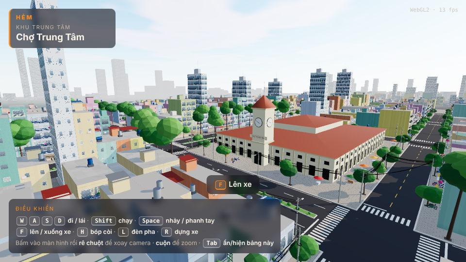

# HẺM — Sài Gòn Không Ngủ

*HẺM: Saigon Never Sleeps* — game hành động thế giới mở góc nhìn thứ 3 trên trình duyệt. Bạn là Tín, tài xế xe ôm công nghệ
bị cuốn vào vòng nợ tín dụng đen, lách xe máy qua phố đông và những con hẻm chằng chịt của một Sài Gòn hư cấu.

> Trạng thái: **M3 — nhiệm vụ + truy đuổi** (chơi được trọn Hồi 1). Một khu phố hư cấu ~520 × 440 m (1.600+ nhà ống,
> mạng hẻm, chợ có tháp đồng hồ, công viên, bờ sông) đông xe máy, người đi bộ đội nón lá, có ngày đêm và mưa rào.
> Tín chạy kèo giao hàng qua điện thoại để trả nợ app vay, luồn hẻm cắt đuôi đàn em của Phát, đi hết 5 nhiệm vụ Hồi 1.
> Game tự lưu.



## Chạy thử
**Chơi ngay, không cần cài gì:** https://kangnahyun23.github.io/HEM-Saigon-Never-Sleeps/
(bản mới nhất trên nhánh `main`, tự deploy qua GitHub Pages).

**Chạy trên máy mình:** cần [Node](https://nodejs.org) ≥ 22.12, rồi chỉ một lệnh:
```bash
npm start
```
Lệnh này tự cài thư viện ở lần đầu (và mỗi khi `package-lock.json` đổi; các lần sau bỏ qua, mất chưa tới 1 giây),
rồi mở game trong trình duyệt tại http://localhost:5173. Máy còn npm 10 cũng không sao — script tự mượn npm 11 qua `npx`.

Bấm vào màn hình để điều khiển camera bằng chuột.

| Phím | Đi bộ | Trên xe |
| --- | --- | --- |
| `W A S D` / mũi tên | đi | ga · phanh/lùi · lái |
| `Shift` | chạy | — |
| `Space` | nhảy | phanh tay |
| `F` | lên xe (khi đứng gần) | xuống xe (khi chạy chậm) |
| `H` / `L` / `R` | — | bóp còi · đèn pha · dựng lại xe |
| Chuột / con lăn | xoay camera · zoom | xoay camera · zoom |
| `P` | điện thoại (Kèo · Bản đồ · Tin nhắn · Ví), `1`–`4` đổi tab, `Esc` cất | như đi bộ |
| `Tab` | ẩn/hiện bảng phím | |

Game tự lưu (sau mỗi nhiệm vụ, mỗi 30 giây, khi rời trang); muốn chơi lại từ đầu thì mở `?moi=1`.

Một ngày trong game dài 24 phút (1 phút = 1 giờ), bắt đầu lúc 16:30. Muốn xem ngay cảnh đêm: mở
http://localhost:5173/?gio=21 (thêm `&mua=1` để xem phố đêm mưa). Trời Sài Gòn hay đổ mưa rào chiều tối.

## Công nghệ
TypeScript · Vite · Three.js (WebGPU, tự lùi về WebGL2) · Rapier physics · Vitest · Playwright.

## Tài liệu
- [Game Design Doc](docs/gdd.md)
- [Quy ước cho Claude / người đóng góp](CLAUDE.md)

## Giấy phép
Mã nguồn: chưa chọn giấy phép. Asset bên thứ ba (nếu có) ghi rõ nguồn trong `public/assets/CREDITS.md`.
